# 部署Keil C51开发环境

Keil C51是美国Keil软件公司（现已被ARM收购）出品的一款支持8051系列单片机的IDE（集成开发环境）

本次PE项目采用的MCU为STC89C52RC，需要用到Keil C51进行工程的创建和编译.

请在[教学资源](http://suat.ysyx.org:81/download.html)下载安装包keil5并解压.

本小节需要用到的程序包括:

- /keil MDK V5.18/c51v959.exe
- /STC-ISP/stc-isp-15xx-v6.88.exe
- /破解程序/Keil MDK V5注册机(2032).exe

Keil C51安装步骤如下：
- 双击安装包c51v959.exe，进入安装向导界面，点击“Next”  
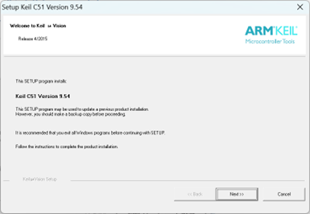

- 勾选"I agree to… ", 点击"Next"

- 选择路径（可以使用默认），点击"Next"

- 填写信息（可以随便填写），点击"Next"  
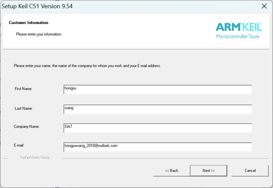

等待安装过程结束，安装完成后，点击"Finish"，安装完成（弹出C51介绍页面可以关闭）

由于免费版有各种限制，需要使用注册机生成注册码，在本项目中我们使用学习版Keil.

注册机的使用步骤如下：
- 首先启动安装好（默认会在桌面创建快捷方式）的Keil uVision5  
注意：**右键点击快捷方式，选择“以管理员身份运行”**
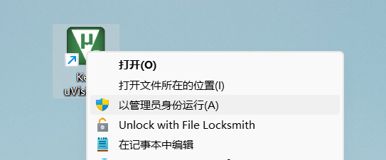  

- 点击"File - License Management..."  
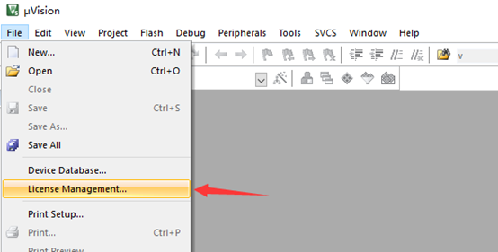  

- 复制右侧的"Computer ID - CID"  
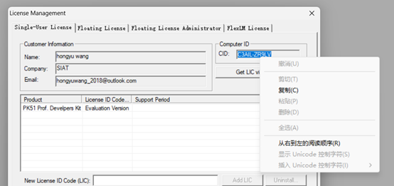  

- 接下来启动之前下载的Keil MDK V5注册机(2032).exe，注意该注册机启动时会有一阵强劲的电吉他，记得提前把音量调小（课堂上最好静音）  
如果出现下图所示的恶意文件提示，点击“更多信息” - “仍要运行”  
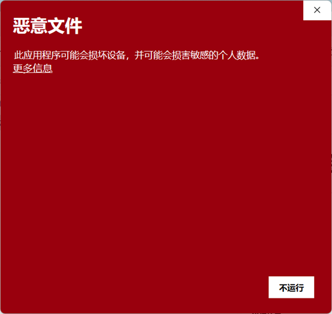  
同时可能还会出现Microsoft Defender的提示，点击“开始菜单” - “设置”  
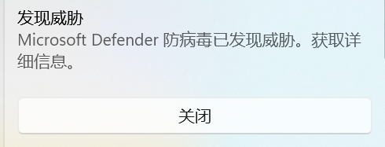  
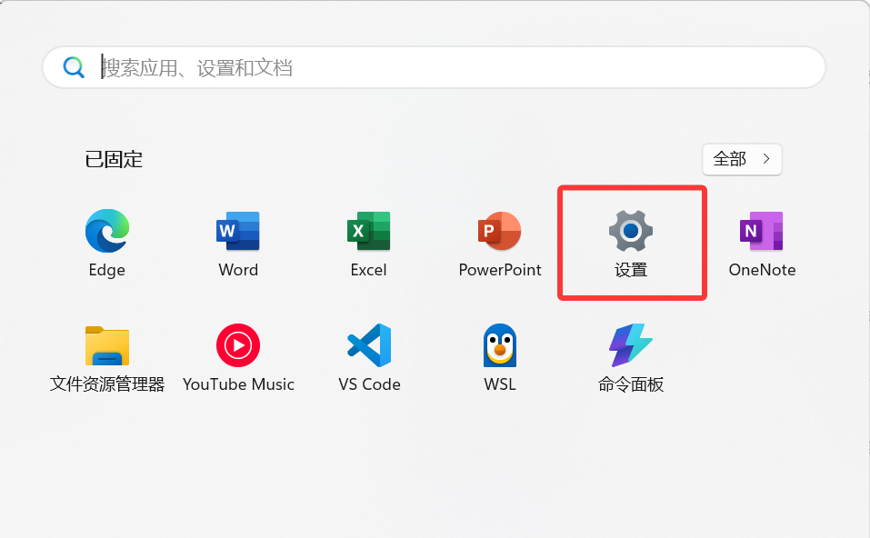  
搜索“安全中心”  
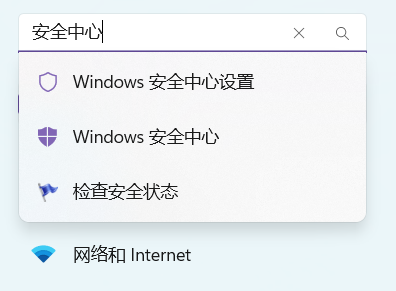  
点击“保护历史记录”，应该能看到时间最接近的一次“已隔离威胁”，展开后选择“操作” - “还原”
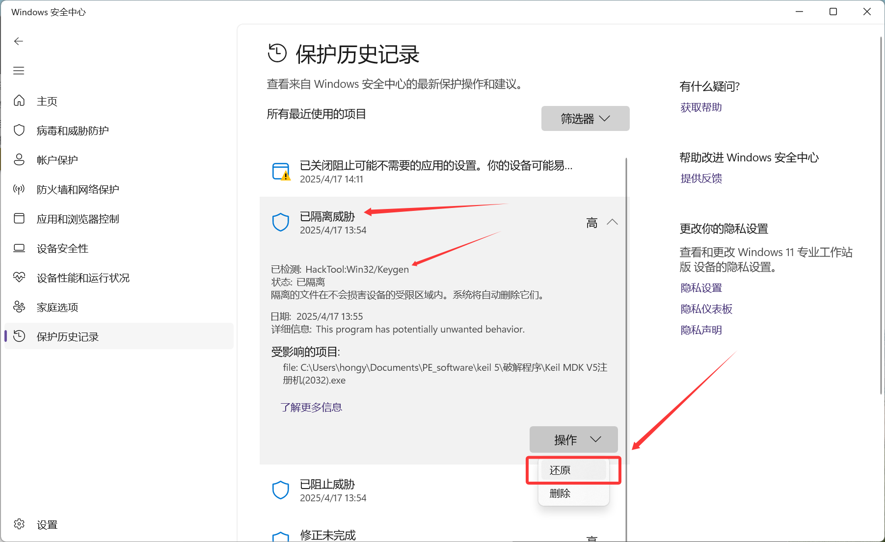  
这时注册机程序应该已经被还原到解压缩的目录下.

- 启动注册机（再次提醒一下音量控制）  
粘贴刚才复制的CID到注册机中的CID一栏去，其他部分不用修改，单击Generate即可。
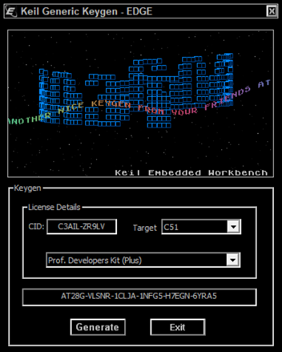  
下面生成的一行就是注册码，复制下来。

- 回到Keil的注册界面：(1)粘贴上面生成的“注册码”，(2)点击“Add LIC”，(3)看见显示信息说明注册成功。
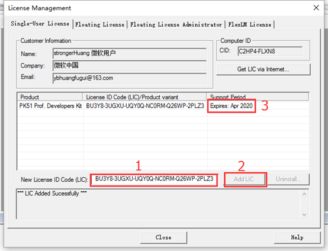  

Keil的安装和破解到这里就结束，由于Keil C51并不官方支持STC系列芯片，我们需要通过刚刚解压的第三个工具为其添加STC89C52RC的配套文件：

- 双击解压的stc-isp-15xx-v6.88.exe，进入界面后在右上角找到“Keil仿真设置”  
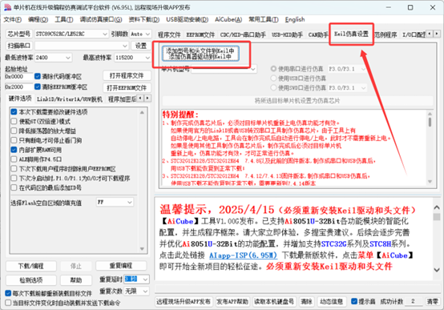  

- 点击“添加型号和头文件到Keil中”，选择Keil安装路径，默认为C:/Keil_v5，单击确定即可.
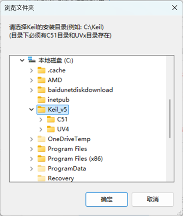  

安装成功后重新启动Keil, 点击Project - Create New Project，应该能在Select Device for Target界面选择STC MCU Database了.  
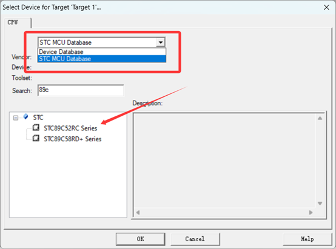  

