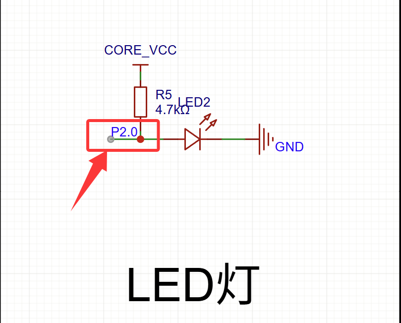
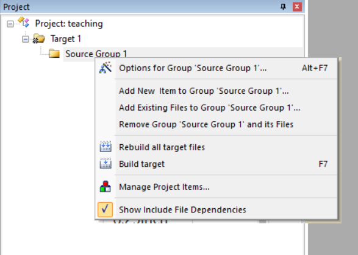
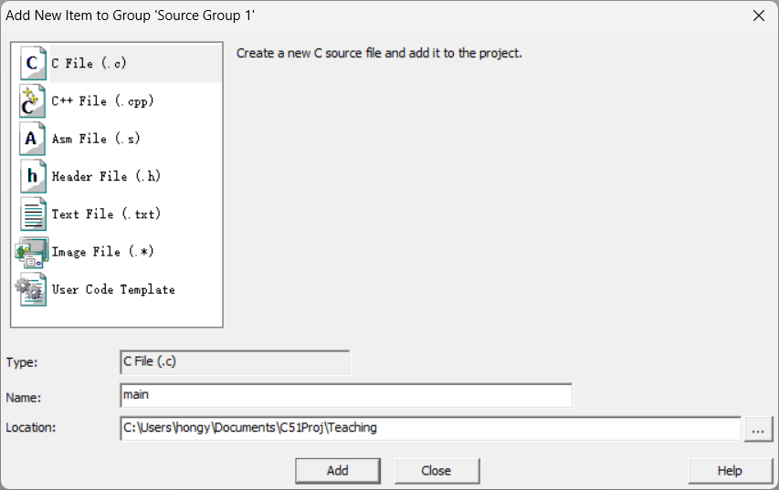
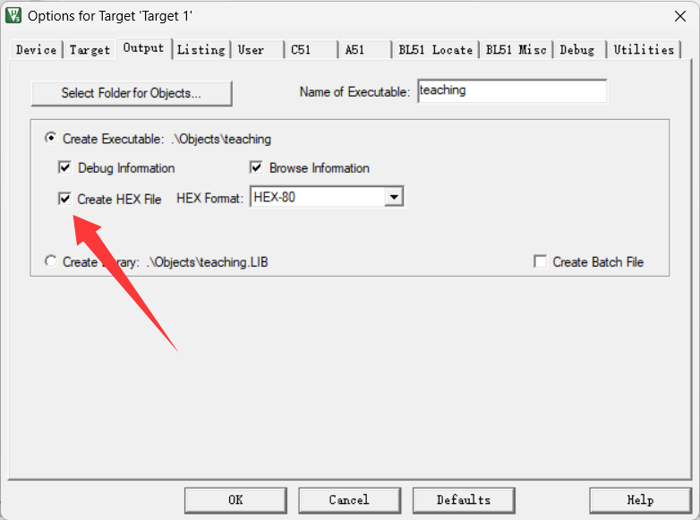
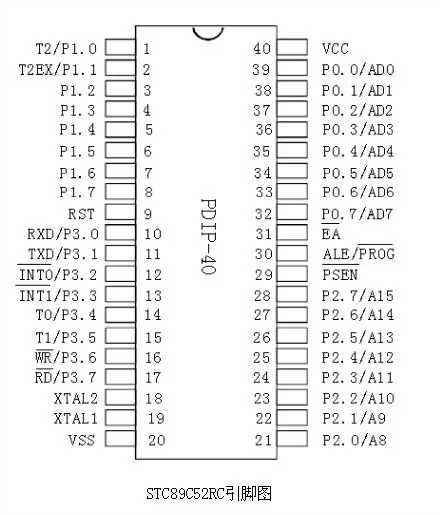
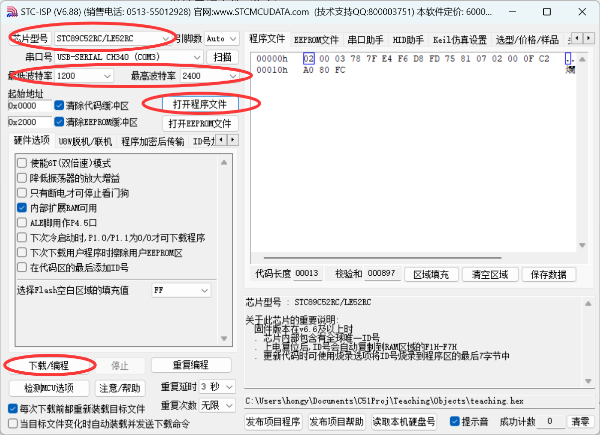

# 单片机开发 - 点亮LED  
现在你已经部署好了开发环境，也拥有了一块由你自己绘制焊接的最小系统板，接下来我们将介绍如何点亮PCB板上的那盏LED灯. 对于很多人来说，点亮LED灯就是他们学习单片机开发的"Hello World".  

## LED - 发光二极管
发光二极管，英文为Light Emitting Diode (LED)，是通过半导体材料制成的二极管，当电流通过时，会发光，发光的强度与电流成正比.  

打开嘉立创EDA，回顾一下你设计的PCB板的原理图，观察LED的连接方式.  

  

如图所示，在示例设计中LED与单片机的P2.0引脚相连，如果你连接了其他引脚也没关系，在后面程序设计时候修改对应的信号即可.  

根据二极管的原理，它在电路中与正负极相连才能够点亮，当P2.0输出高电平时，P2.0与VCC电位相近，LED两端没有足够的电压差，没有电流流过LED，LED不会亮. 当P2.0输出低电平时，P2.0与GND电位相近，LED两端有足够的电压差，电流流过LED，LED会亮. 

## 建立工程

打开Keil uVision5，点击"Project - New uVision Project"，在弹出的窗口新建一个工程文件夹，并为工程文件起一个名字，点击保存.  

在弹出的Select Device窗口中的第一个下拉栏里选择STC MCU Database，并Search 89C52RC，选中后点击OK. 然后会弹出一个启动文件窗口，这里我们选择否.  

  

今后我们的开发就会在如上的窗口进行.

为了创建第一个C文件，我们在Project窗口中展开Target1，右键点击"Source Group 1"，选择"Add New Item to Group 'Source Group 1'"，在弹出的窗口中选择"C File", 为文件命名，点击保存.

  

  

## 程序编写

下面开始编写C语言程序，正如我们在PC进行C开发时的第一步，需要声明程序所包含的头文件，在单片机上也不例外. 不同的是，你使用的不再是 "stdio.h"等来自标准库的头文件，而是STC89C52RC的头文件. 因为我们在前面已经为Keil添加好了STC系列的库. 你只需要右键点击main.c的空白处，编辑器会出现Insert '#include <STC89C5xRC.H>'的选项，选择即可.

BTW： 你可以右键点击include这一行，选择Open Document，自行查看头文件的内容，看看它都写了什么.  

根据刚刚所提到的原理，我们需要控制P2.0接口，来使LED点亮或者熄灭. 在头文件里，P2.0接口的定义是变量P20，也就是说，我们只要对P20进行赋值，就可以控制P2.0接口发出的信号，理解原理后，不难写出如下的程序：

```c
#include <STC89C5xRC.H>

void main()
{
	while (1){
		P20 = 0x00;//给端口赋值为0，使其发出的信号为低电平
	}
}
```
代码编写好后，我们就可以对程序进行编译了，注意，在Keil上我们用中文表达的**编译**被翻译为"**Translate**"而不是熟知的"Compile"，这是因为过程不仅包含了Compile，还包括了链接等其他步骤.

```
compiling main.c...
main.c - 0 Error(s), 0 Warning(s).
```
编译成功后，我们可以看到报错和警告都为0，可以构建为能够下载到单片机上的HEX文件了. 这里需要注意的是，在构建之前，我们需要配置一下工程，单击一下第三行的Options for Target图标(如图所示)  
  
找到Output选项卡，勾选上Create HEX File，以使其生成HEX文件.  
  
勾选后点击OK.

接下来，我们就可以构建工程了，单击编译右侧的Build图标，能看到控制台输出了
```
linking...
Program Size: data=9.0 xdata=0 code=19
creating hex file from ".\Objects\teaching"...
".\Objects\teaching" - 0 Error(s), 0 Warning(s).
Build Time Elapsed:  00:00:00
```
可以观察到HEX文件被生成在工程目录下的Objects文件夹中. 以"工程名.hex"命名.

## 程序烧录

如何将生成的HEX文件烧录到单片机中呢，这里我们使用USB-TTL转接器把PC与单片机进行连接. 
首先使用杜邦线连接USB-TTL转接器的4个引脚到单片机的4个引脚：

- USB-TTL转接器的VCC引脚连接到单片机的VCC引脚
- USB-TTL转接器的GND引脚连接到单片机的GND引脚
- USB-TTL转接器的TXD引脚连接到单片机的RXD引脚
- USB-TTL转接器的RXD引脚连接到单片机的TXD引脚

TXD和RXD的位置可以在引脚图上查看  
  

连接好后，插入USB-TTL转接器到电脑的USB接口，打开STC-ISP工具，在左上角的芯片型号处的下拉栏中选中STC89C52RC，调整波特率为最低1200，最高2400.  

  

然后点击"打开程序文件", 选择工程目录下的Objects文件夹中的"工程名.hex"文件并打开. 

点击"下载"，会进入检测目标单片机状态中，按下单片机的开关键，程序应该能识别到单片机，等待烧录完成，LED灯亮起.
