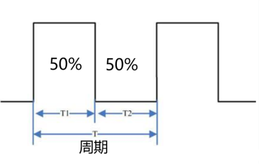
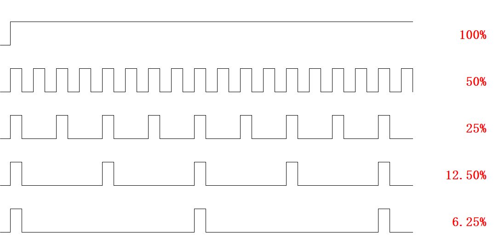

# PWM 呼吸灯

## 1. 什么是PWM

脉冲宽度调制(PWM)，是英文"Pulse Width Modulation"的缩写，简称**脉宽调制**，是利用微处理器的数字输出来对模拟电路进行控制的一种非常有效的技术，广泛应用在从测量、通信到功率控制与变换的许多领域中。

## 2. PWM的频率

指1秒钟内信号从高电平到低电平再回到高电平的次数（一个周期）

## 3. PWM的周期
T=1/f
周期=1/频率
50Hz = 20ms 一个周期

如果频率为50Hz，也就是说一个周期是20ms，那么一秒钟就有50次PWM周期

## 4. 占空比

**定义**：一个脉冲周期内，高电平的时间与整个周期时间的比例  
**单位**：%（0%-100%）  
**表示方式**：20%  



**周期为T**  
- T1为高电平时间  
- T2为低电平时间  

**示例**：  
假设周期T为1s，那么频率就是1Hz  
- 高电平时间0.5s  
- 低电平时间0.5s  
- 总占空比 = 0.5/1 = 50%  

控制LED的通断时间比例（占空比）如下图：  


## 5. 控制流程

控制分为两个阶段：
1. **由暗到亮**：输出占空比由0%到100%以1%为间隔递增，共100个周期
2. **由亮到暗**：输出占空比由100%到0%以1%为间隔递减，共100个周期

## 6. 代码
### 由暗到亮代码：

```c
for(Time=0;Time<100;Time++) // 改变亮灭时间，由暗到亮
{
    for(i=0;i<20;i++) // 计次延时
    {
        LED=0;       // LED亮
        Delay(Time);  // 延时Time
        LED=1;       // LED灭
        Delay(100-Time); // 延时100-Time
    }
}
```

```c
### 由亮到暗代码：
for(Time=100;Time>0;Time--) // 改变亮灭时间，由亮到暗
{
    for(i=0;i<20;i++) // 计次延时
    {
        LED=0;       // LED亮
        Delay(Time);  // 延时Time
        LED=1;       // LED灭
        Delay(100-Time); // 延时100-Time
    }
}
```

### 完整代码：
<details>
<summary>点击展开</summary>  

```c
#include <STC89C5xRC.H>

sbit LED=P2^0; // 根据自己的引脚绑定

void Delay(unsigned int t)
{
    while(t--);
}

void main()
{
    unsigned char Time,i;
    while(1)
    {
        for(Time=0;Time<100;Time++) // 改变亮灭时间，由暗到亮
        {
            for(i=0;i<20;i++) // 计次延时
            {
                LED=0;       // LED亮
                Delay(Time);  // 延时Time
                LED=1;       // LED灭
                Delay(100-Time); // 延时100-Time
            }
        }
        
        for(Time=100;Time>0;Time--) // 改变亮灭时间，由亮到暗
        {
            for(i=0;i<20;i++) // 计次延时
            {
                LED=0;       // LED亮
                Delay(Time);  // 延时Time
                LED=1;       // LED灭
                Delay(100-Time); // 延时100-Time
            }
        }
    }
}
```
</details>