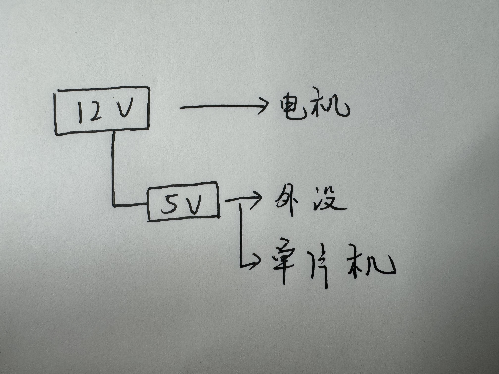
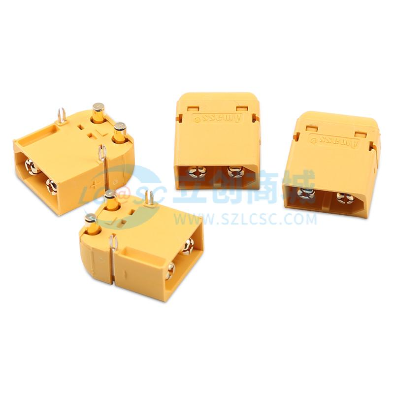
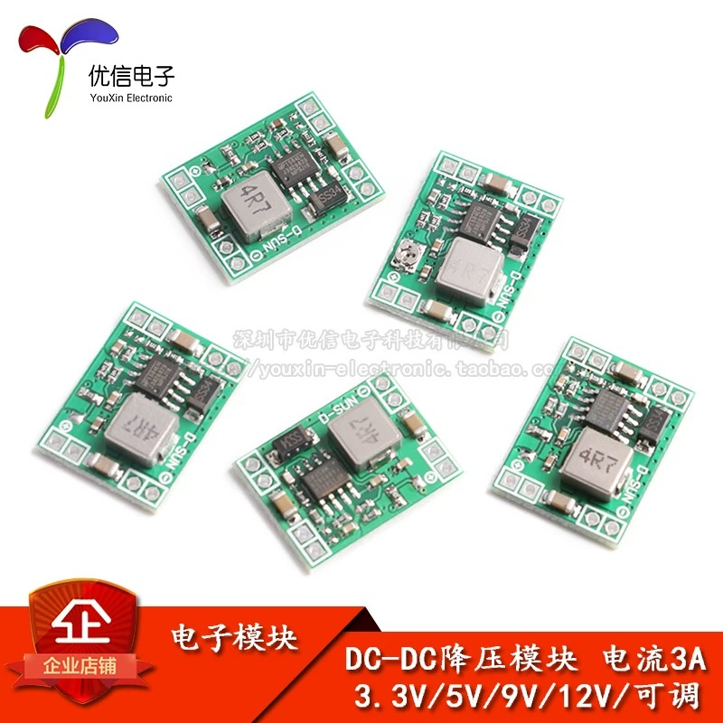
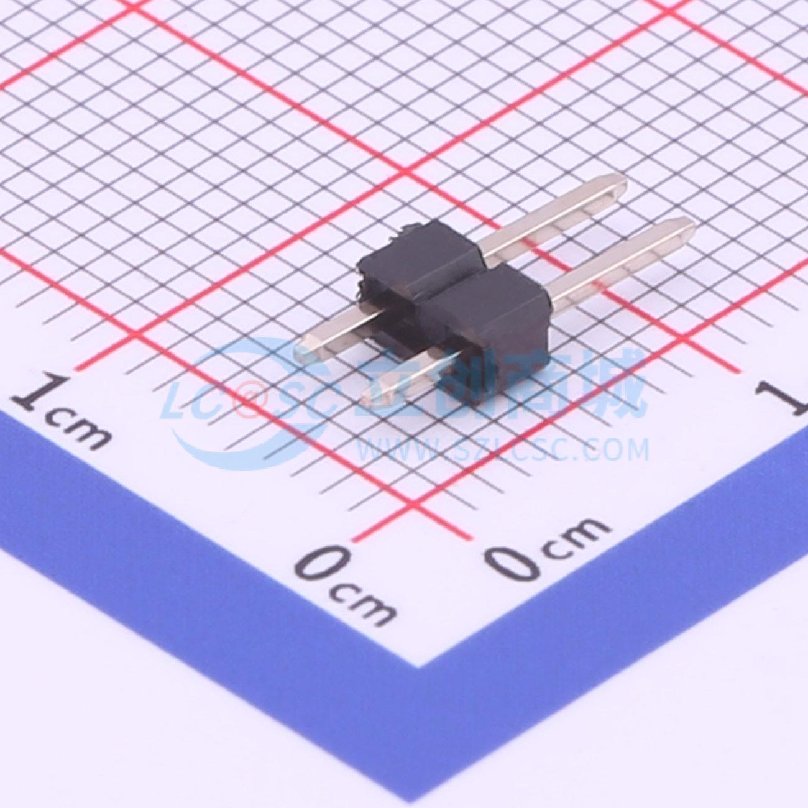
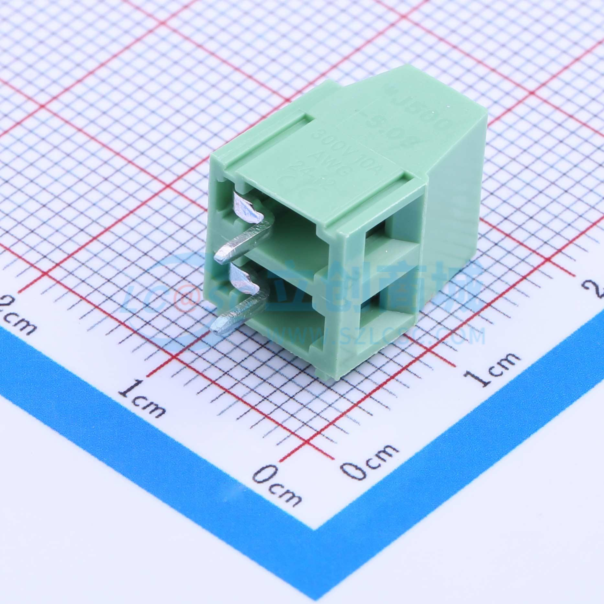
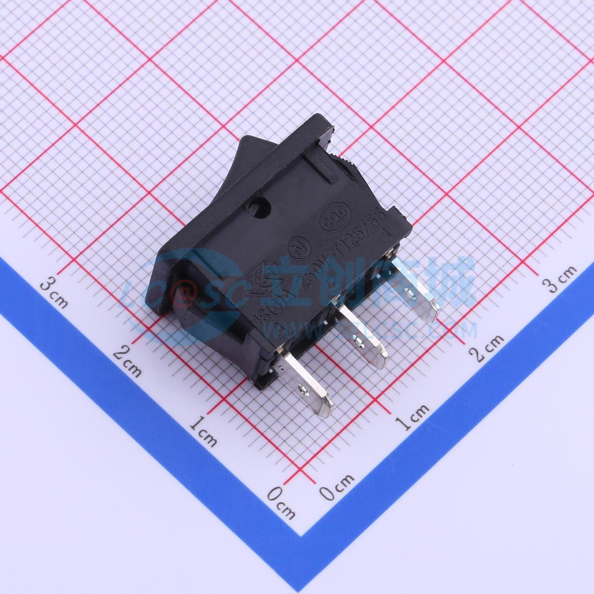

# 电源模块
## 电源需求分析
- C51单片机需要5V供电
- 传感器、外设等模块需要5V供电
- L298N电机模块需要12V供电

## 电源层级分析
### 输入
- 电源模块的输入采用3S的航模电池，输入电压12V左右，可输出60A的电流
### 输出
- TT电机：供电电压为3~12V，堵转的最大电流达1.5A左右
- 外设传感器：供电电压5V，电流在几十到几百mA左右

## PCB设计关键点
### 器件介绍
- XT60接口（立创编号-C98732）：用于连接大电流电池

- DCDC降压模块：用于将12V的电压转换为5V电压

- 排针接口：用于连接DCDC模块、控制板以及外设

- WJ500V接口（立创编号-C8465）：用于连接L298N与电源管理模块

- 船型开关（立创编号-C309067）：用于控制电源板卡的电路通断

- 其余贴片器件只限制封装
电阻、电容、LED灯使用0603贴片封装即可
- 附上<a href="../../public/PE_resource/power_module/工作室物料清单.xls" target="download">工作室物料清单</a>，请优先依照该物料清单进行原理图设计

### 注意事项（也是得分扣分点）
- 所有接口类器件应靠近板边摆放，方便插拔
- 给板卡设计简单明了的丝印标注
- 使用LED灯反应电源板卡的工作情况